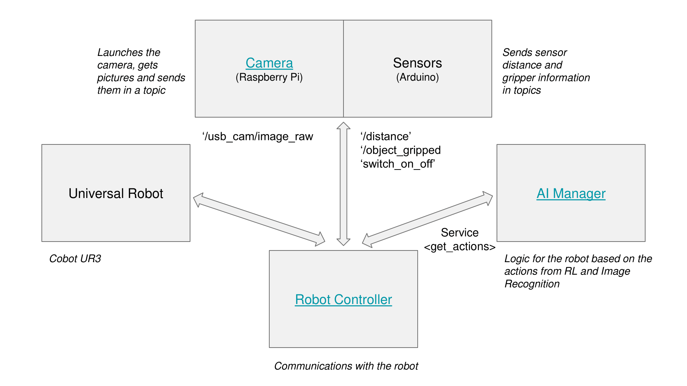
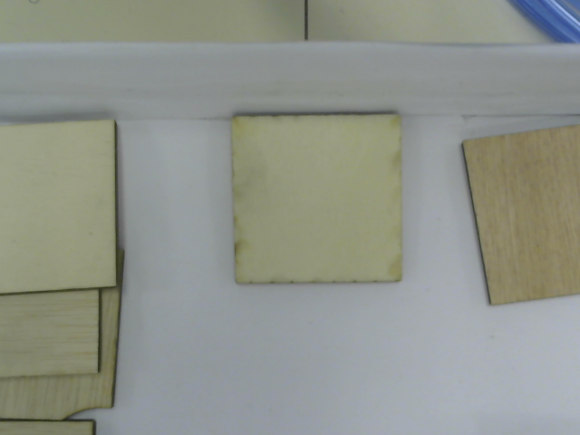

# ai_manager
_ai_manager_ is just one of the pieces of a bigger project that aims to control a robotic arm to perform a pick and place 
task of disordered pieces placed in a box. The robot has to be controlled by a software able to identify the objects,
and the best set of movements available to empty the box as fast as possible.

This Software is made using a microservices Architecture with ROS (Robotic operative System), and ai_manager is one of 
the modules of this architecture, as we can see in the following image:

_ai_manager_ module is the "intelligence" of the robot, responsible for making it learn by training a Deep Reinforcement 
Learning Algorithm. Using this algorithm, the robot (**agent**) will explore the **Environment** by performing a set of
**actions**. Once these actions are performed, the agent will receive a **reward** that can be positive, neutral or 
negative depending on how far the agent it from the **objective**.

Each time the agent perform an action, it reaches a new **state**. States can be transitional or terminal, when the 
agent meets the objective or when it gets to a forbidden position. Each time the agent reaches a terminal state, an
**episode** is ended, and a new one is started.

## Definition of the problem

The objective of the agent is thus the first thing that has to be defined. It is simple: **pick a piece**. 

Then, the environment, the states and the actions have to be defined together. These decisions are conditioned by the 
hardware and materials available. In our case, we have a UR3 robot with six different points of movements, and a vacuum
gripper. That means that the best way of griping an object is by facing the gripper to the floor and move it vertically 
until it gets in contact with the object, where the vacuum can be powered on, and we can know if the object has been 
griped or not.

Having this in mind, we have decided that the robot have to be fixed in a specific height with the gripper facing down.
Then, the actions will be "**north**", "**south**", "**east**" or "**west**" to move the robot through the x-y plane 
formed by these movements in the selected robot height, "**pick**", to perform the gripping process described before and
place the object in the box, and "**random_state**" to move the robot to a new random state when a terminal state is 
reached.

### Environment.py

The environment is defined in Environment.py class. There, we can find different parameters and methods. All of them are 
explained in the code, but we will briefly explain them here. The `CARTESIAN_CENTER` and the `ANGULAR_CENTER` represent 
the same point in the space, but using different coordinates. This point should be the x-y center of the picking box
with the robot height defined before as z point. As starting point, we need to use the `ANGULAR_CENTER` because we want
the robot to reach this point with the gripper facing down.

Then, we have to define the edges of the box as terminal states, because we just one the robot to explore inside the 
box. To define these limits, we use `X_LENGTH` and `Y_LENGTH` parameters, which are the X and Y lengths of the box in 
cm.

Other important parameters to define are the center of the box where we will place all the objects 
(`PLACE_CARTESIAN_CENTER`) or the distance that the robot has to move in each action (`ACTION_DISTANCE`).

Finally, the methods defined in this class are:

- `generate_random_state(strategy='ncc')`, which is used when the agent reaches a terminal state and needs a new random 
  state.
- `get_relative_corner(corner)`, which returns the relative coordinates of a corner of the box
- `is_terminal_state(coordinates, object_gripped)`, which returns a boolean telling whether a given state is terminal or
  not using the parameters given.
  
### Rewards

Rewards are one of the most difficult-to-define parameters. In this case, rewards are deffined in the EnvManager inner 
class of RLAlgorithm.py. The specific value of the rewards are not given here because they are different from one
training to another, but we give (positive or negative) rewards for:

- Terminal state after picking a piece.
- Terminal state after exceeding the box limits.
- Non terminal state after a pick action
- Other non terminal states

## Algorithm
The algorithm used in this project is a **deep Q Learning** algorithm. In this type of algorithms, images are used as 
inputs. These images represent the state of the agent and are passed through a convolutional neural network in order to extract 
their features. 

In our case, the camera is sticked to the robot and moves with it giving a partial view of the environment as the one 
showed in the image below.

This algorithm is implemented in the class RLAlgorithm.py following this schema:
  1. Initialize **replay memory** capacity.
  2. Initialize the **policy network** with random weights.
  3. Clone the policy network, and call it the **target network**.
  4. **For each episode**:
     1. Initialize the starting state.
      2. **For each time step**:
          1. Select an **action**.
              - Via exploration or exploitation
          2. **Execute** selected **action** in an emulator or in Real-life.
          3. **Observe reward** and next state.
          4. **Store** experience **in replay memory**.
          5. Sample **random batch from replay memory**.
          6. **Preprocess states** from batch.
          7. **Pass batch** of preprocessed states **to policy network**.
          8. **Calculate loss between output Q-values and target Q-values**.
              - Requires a pass to the target network for the next state
          9. Gradient descent **updates weights in the policy network** to minimize loss.
              - After time steps, weights in the target network are updated to the weights in the policy network.
  
To understand better all these steps is highly recommended to follow the [DeepLizard's Reinforcement Learning course.](
https://deeplizard.com/learn/playlist/PLZbbT5o_s2xoWNVdDudn51XM8lOuZ_Njv)

### RLAlgorithm.py
RLAlgorithm.py is the most important file of this module because it is the place where the algorithm implementation is
done. Several classes have been used to implement the algorithm. Some of these classes are defined inside RLAlgorithm 
(inner classes) and others are normal outer classes.

In RLAlgorithm.py, we define the RLAlgorithm class, which also have several inner classes. These classes are:
 - **Agent**: Inner class used to define the agent. The most important thing about this class is the **select_action**
   method, which is the one used to calculate the action using whether **Exploration** or **Exploitation**.
 - **DQN**: Inner class used to define the **target and policy networks**. It defines a neural network that have to be 
   called using the vector of features calculated by passing the image through the feature extractor net.
 - **EnvManager**: Inner Class used to manage the RL environment. It is used to perform actions such as **calculate 
   rewards** or **gather the current state** of the robot. The most important methods are:
   - **calculate_reward**, which **calculates the reward** of each action depending on the initial and final state.
   - **extract_image_features**, which is used to transform the image to extract image features by passing it through a 
     **pre-trained CNN network** that can be found in ImageModel Module.
 - **EpsilonGreedyStrategy**: Inner Class used to perform the Epsilon greede strategy
 - **QValues**: Inner class used to **get the predicted q-values** from the policy_net for the specific state-action pairs 
   passed in. States and actions are the state-action pairs that were sampled from replay memory.
 - **ReplayMemory**: Inner Class used to create a Replay Memory for the RL algorithm
 - **Environment**: Class where the RL Environment is defined
 - **TrainingStatistics**: Class used to store all the training statistics. If it is run separately, It will plot a set
   of graphs to represent visually the training evolution.
 - **ImageModel**: Class used to extract the image features used in the training. You can find this class in [this 
   repository](https://github.com/PilarHB/ImageProcessing), which store another module of this project.
 - **ImageController**: Class used to gather and store the relative state images from a ros topic.

In order to perform the algorithm there are two important structures that are defined in the beginning of this file.
These structures are:
 - **State**, which defines all the things needed to represent a State:
    - Coordinates of the robot. 
    - Image.
    - Boolean telling if an object has been gripped. 
 - **Experience**, which represents the experience of the agent in a given moment:
     - The action.
     - The original state.
     - The original coordinates.
     - The final state.
     - The final coordinates.
     - The reward obtained for taking this action.
     - Boolean telling whether the final state is terminal or not.

Finally, there are some important methods in RLAlgorithm class that it is important to take into account:
 - **save_training**: Method used to **save the training** so that it can be retaken later. It uses pickle library to do so 
   and stores the whole RLAlgorithm object because all the context is needed to retake the training.
   This method also stores a pickle a **TrainingStatistics object** for them to be accessible easily.
 - **recover_training**: Method used to recover saved trainings. If it doesn't find a file with the name given, it 
   creates a new RLAlgorithm object.
 - **train_net**: Method used to train both the train and target Deep Q Networks. We train the network minimizing the 
   loss between the current Q-values of the action-state tuples and the target Q-values. Target Q-values are calculated 
   using thew Bellman's equation:

   `q*(state, action) = Reward + gamma * max( q*(next_state, next_action) )`
 - **next_training_step**: This method implements the Reinforcement Learning algorithm to control the UR3 robot.  As the 
   algorithm is prepared to be executed in real life, rewards and final states cannot be received until the action is 
   finished, which is the beginning of next loop. Therefore, during an execution of this function, an action will be 
   calculated and the previous action, its reward and its final state will be stored in the replay memory.

